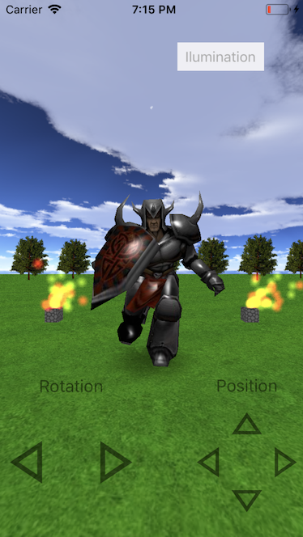

# GLProject

GLProject was my student project for the assignature Computer Graphics in the Univerity. Basically is an openGL ES 2.0 app that have some nice features like:

- Scene graph
- Loads MD2 objects
- Keyframe aniamtion
- Manages multiple lights
- Particles system
- Billboard textures
- Skybox

Screenshot:

